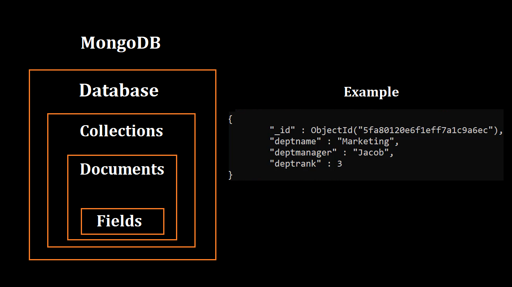

# Learning MongoDB Database
> ### Connecting to database:
>>```mongosh "mongodb+srv://cluster0.ex4ht.mongodb.net/myFirstDatabase" --apiVersion 1 --username YOUR_USER_NAME```

Visual Representation of MongoDB:


> ### Create Collection using mongosh
>> Method 1: ```db.createCollections("names")```
>> Method 2: ```db.posts.insertOne(object)```
> In MongoDB, a collection is not actually created until it gets content!


### [Insert Documents](Notes/InsertDocument.MD)

### [Find Methods](Notes/Find.MD)


